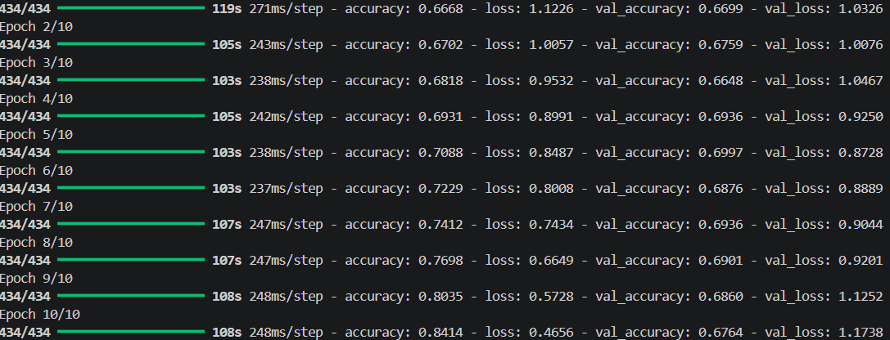

# Project : introduction_to_computer_vision
Giuseppe Calvaruso's Computer Vision Exam:Segmentation and classification of skin cancer images

## General overview 
This is an example of classification about skin cancer cells.The objective is to detect 7 skin tumors through  **Computer Vision**. The project follow a strict pipeline, starting from data managemente (also called EDA) finishing with the model and valuation of the model : a  **CNN (Convolutional Neural Network) d**.

## Pipeline e Architettura
Il progetto è strutturato secondo una metodologia modulare:

1. **Acquisizione Dati:** Il dataset è gestito localmente. Il caricamento avviene tramite la pipeline di `tf.keras.utils.image_dataset_from_directory`, che elabora le immagini direttamente dalle sottocartelle (`train`, `valid`, `test`) in modo efficiente.
2. **Preprocessing:** Le immagini sono ridimensionate a 224x224 pixel e normalizzate (riscalate) per garantire la convergenza del modello.
3. **Baseline Architecture:** A sequential CNN was implemente from scratch, composed by :
   - Convolution Layer (`Conv2D`) with `ReLU` as activaction function.
   - Pooling Layer (`MaxPooling2D`) to reduce dimensionality.
   - Final layer `Dense`with  `softmax` activaction to do multiclass classification .

## Set-Up Instructions 

### Prerequisites
Install python with following dependencies:  

`
pip install tensorflow matplotlib numpy scikit-learn `

### Execution  
Verify that the following folder (train,test and validate) are in the main project folder 

Execute the following scritp:  
`python Giuseppe_Calvaruso.py`

### Baseline Result  

Training Accuracy: 0.7766

Validation Accuracy: 0.7204

This values are the starting point of a better model. It is needed in order to do Failure Analysis and to test advanced technique lile data augmentation, class balancin and hyperparameter tuning 