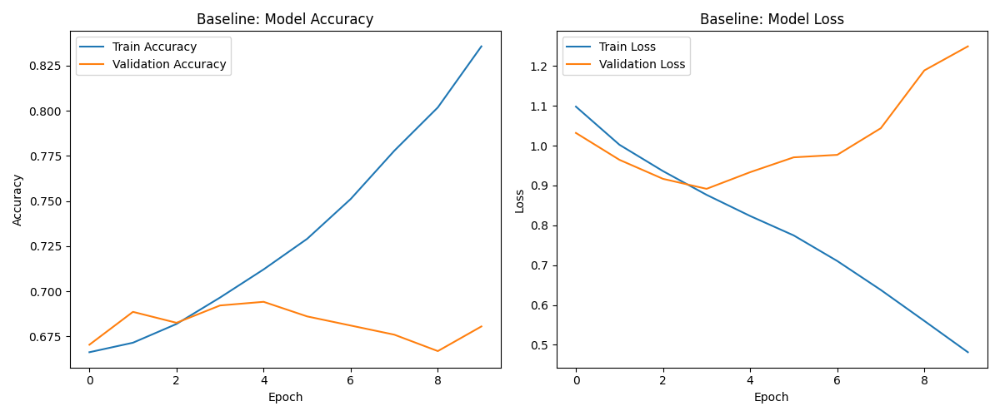

# Project : introduction_to_computer_vision
Giuseppe Calvaruso's Computer Vision Exam:Segmentation and classification of skin cancer images

## General overview 
This is an example of classification about skin cancer cells.The objective is to detect 7 skin tumors through  **Computer Vision**. The project follow a strict pipeline, starting from data managemente (also called EDA) finishing with the model and valuation of the model : a  **CNN (Convolutional Neural Network) d**.

## Pipeline and Architecture 

1. **Data Acquisitiion :** dataset  locally managed using  `tf.keras.utils.image_dataset_from_directory`, taking img from subfolder (`train`, `valid`, `test`) efficiently
2. **Preprocessing:** Img are resized to be manage from model 
3. **Baseline Architecture:** A sequential CNN was implemente from scratch, composed by :
   - Convolution Layer (`Conv2D`) with `ReLU` as activaction function.
   - Pooling Layer (`MaxPooling2D`) to reduce dimensionality.
   - Final layer `Dense`with  `softmax` activaction to do multiclass classification .

## Set-Up Instructions 

### Prerequisites
Install python with following dependencies:  

`
pip install tensorflow matplotlib numpy scikit-learn `

### Execution  
Verify that the following folder (train,test and validate) are in the main project folder 

Execute the following script:  
`python Giuseppe_Calvaruso.py`

### Baseline Result and Valuation
#### Training result and overfitting

To build a resilient model, I've trained one at 10 epochs and after that i"ve added other 20 epochs, in order to choose the best one. 
In the following image, you can see some results about overfitting. 

(on the left a 10 epoch gprah, on the right the model after adding other 10 epochs)
The graph show an earlier overfitting. 
After this analysis, i choosed the 10 epoch model. 

#### Metrics analysis
From `baseline_classificiation_report_10_epoch.txt` and `baseline_classificiation_report_20_epoch.txt`
I made a comparative analysis about metrics. 
In test there's a majority class `nv` (data augmentation is necessary for other class).
Due to medical/health concern, and due to better model performance, is necessary to focus on recall, cause only the 19% `mel` class (melanome) is diagnosyzed 

### Confusion Matrix
From heat map of Confusion Matrix is explained:
1) on the 20 epochs model , 64 `mel` (melanome) are predicted as `nv` (benign tumor)
2) minority class such as `df` (dermatophybroma) or `vasc`(vascular lesion) are not  well rappresented  
We need further improvement in order to detect better the 3 tumoral forms: `mel`, `bcc` and `akiec`

## First experiment : Data augmentation  
In order to improve the model, I'm going to do data augmentation . New File with same base code.

