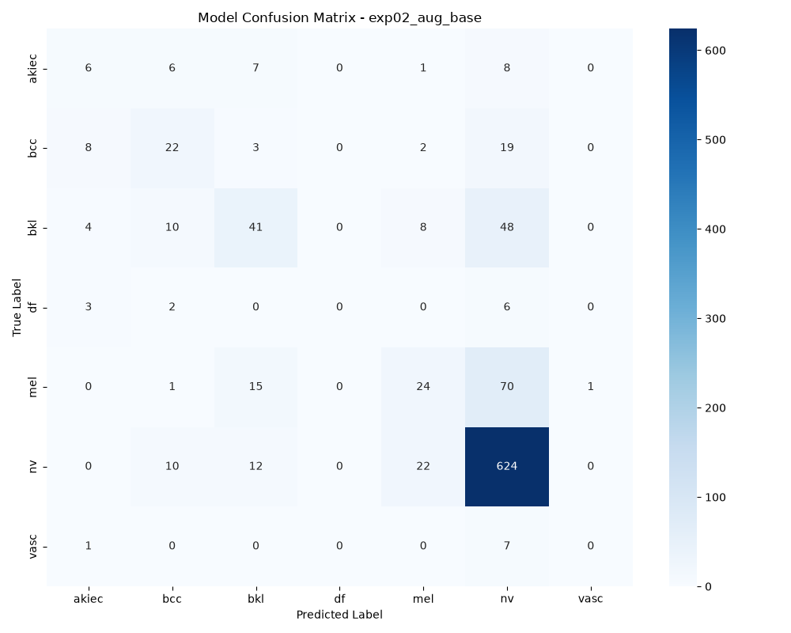
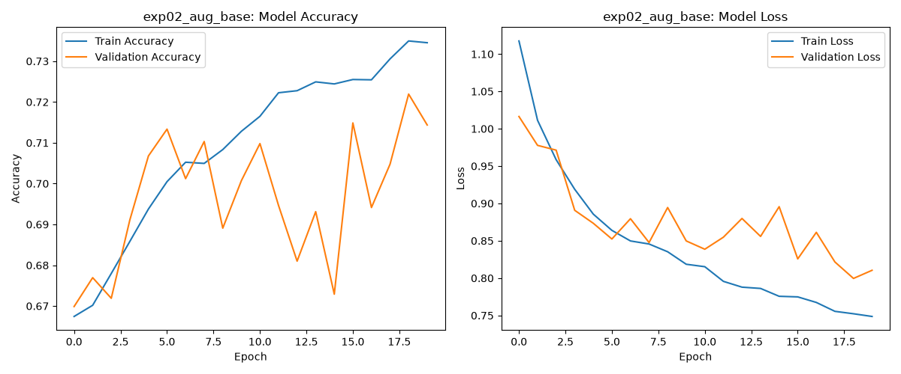
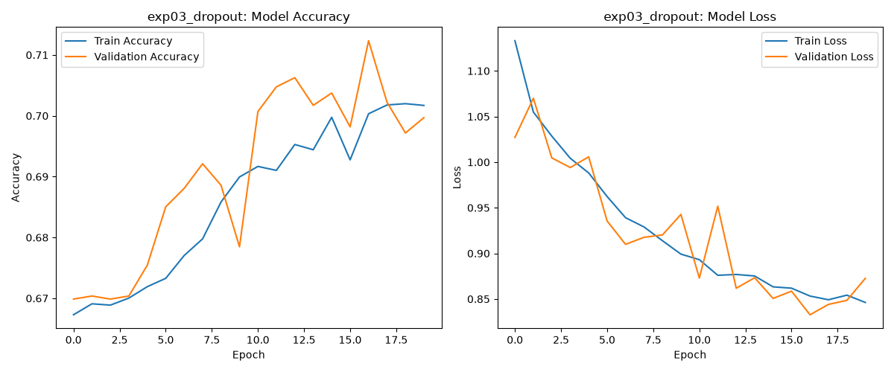

# Project : introduction_to_computer_vision
Giuseppe Calvaruso's Computer Vision Exam:Segmentation and classification of skin cancer images. 
For visual executive summary see [Computer _vision_Giuseppe_Calvaruso.pdf](/Computer%20_vision_Giuseppe_Calvaruso.pdf) 
Disclaimer: some model.h5 has not been uploaded to github file size limitation 

## General overview 
This is an example of classification about skin cancer cells.The objective is to detect 7 skin tumors through  **Computer Vision**. The project follow a strict pipeline, starting from data managemente (also called EDA) finishing with the model and valuation of the model : a  **CNN (Convolutional Neural Network) **.

## Pipeline and Architecture 

1. **Data Acquisition :** dataset  locally managed using  `tf.keras.utils.image_dataset_from_directory`, taking img from subfolder (`train`, `valid`, `test`) efficiently
2. **Preprocessing:** Img are resized to be manage from model 
3. **Baseline Architecture:** A sequential CNN was implemente from scratch, composed by :
   - Convolution Layer (`Conv2D`) with `ReLU` as activaction function.
   - Pooling Layer (`MaxPooling2D`) to reduce dimensionality.
   - Final layer `Dense`with  `softmax` activaction to do multiclass classification .

## Set-Up Instructions 

### Prerequisites
Install python with following dependencies:  

`
pip install tensorflow matplotlib numpy scikit-learn `

### Execution  
Verify that the following folder (train,test and validate) are in the main project folder 

Execute the following script:  
`python Giuseppe_Calvaruso.py`

## Baseline Result and Valuation

### Training result and overfitting
To build a resilient model, I've trained one at 10 epochs and after that i"ve added other 20 epochs, in order to choose the best one. 
In the following image, you can see some results about overfitting. 

(on the left a 10 epoch gprah, on the right the model after adding other 10 epochs)
The graph show an earlier overfitting. 
After this analysis, i choosed the 10 epoch model. 

### Metrics analysis
From `baseline_classificiation_report_10_epoch.txt` and `baseline_classificiation_report_20_epoch.txt`
I made a comparative analysis about metrics. 
In test there's a majority class `nv` (data augmentation is necessary for other class).
Due to medical/health concern, and due to better model performance, is necessary to focus on recall, cause only the 19% `mel` class (melanome) is diagnosyzed 

### Confusion Matrix
From heat map of Confusion Matrix is explained:
1) on the 20 epochs model , 64 `mel` (melanome) are predicted as `nv` (benign tumor)
2) minority class such as `df` (dermatophybroma) or `vasc`(vascular lesion) are not  well rappresented  
We need further improvement in order to detect better the 3 tumoral forms: `mel`, `bcc` and `akiec`

## First experiment : Data augmentation  
In order to improve the model, I'm going to do data augmentation . New File with same base code.
The purpose of Data augmentation is to reduce overfitting.
After the first cycle of training with data augmentation,I've received the following Results:  

Test Accuracy : 72.35%  
Test Loss : 0.7934  

### Performance analysis
Even with data augmentation, The model has difficulty. This is caused because classes are unbalanced    

#### NV class  
This is the majority class  

#### MEL  
This is the class wher I want an high recall because It is the most dangeorus skin cancer cell. 

#### DF and VASC  
These are rare patology, ignored by the model  

### General final observation with Data Augmentation  
Only data augmentation does not resolve anything, going for other improvement

  

## Dropout Regolarization  
In this experiment, I've introduced a 0.5 dropout.
This is needed in order to permit the model to generalize better.  

### Graph analysis  

The gap between the curves is reduced  
  
The model begin to stop to memorize the train set  

### Performance and class imbalance  
The model is more solid and stable, but we continue to have the unbalanced classes. 
Maybe in the next session, I'm going to assign weight or add more layer.  

## Deeper and wider approach  
I've added some filter to the new model in order to see if more estractive capacity was useful.  

### Results  
Accuracy:71.4%  
Test Loss :  0.8462  

### Performance analysis  
having more complexity does not resolve the problem, it degrades the model  

mel  : recall is worst than dropout exp  
Conclusion: I need to balance data or give weight to class

## Class weights : the disaster  
To fight the unbalanced classes, i've used a dictionary with class weights.
This experiments has collapsed the model.   

### Failure analysis  
I've used very heavy weights to unbalanced classes but the model has suffered from gradient explosion during backpropagation.  

## EXP6 : HYPERTUNING AND SOFT WEGHTS.  
I've choosed the best model (dropout) and i've applied soft weights. I've reduced the learning rate.  

### Results  
ACCURACY: 47.93%
TEST LOSS: 1.3247  

### PERFORMANCE ANALYSIS  
Even if accuracy and test loss are not ideal, the model have high recall on malicious skin cancer cells.
The model has started to recognize complex pattern  

Mel  
Recall from 0.28 to 0.5  

I'm continuing to work on this model before shifting to a transfer learning model  

## Experiment 7 : Clinical decision threshold  
The previous model has used the softmax decision function. 
For cancer diagnostic, I need to use other decision function. A false negative cost is higher than a false positive.
I've allineed the model: if a mel class has a >15% probabiliy, the prediction is forced.  

### Results  
Recall of melanoma up to 77%, precision lowered to 13%  

### Experiment Conclusion  
In healthcare is better to have recall than precision 

## Experiment 8: A more balanced approach with F1 score  
This model is more balanced. 
The model of experiment 7 is more focused over recall (more allarmistic).
This model instead save the weight only where the armonic mean was better  

### Results  
Accuracy: 65.09%
Macro f1-score: 0.29
mel: precision 27%, recall 32%, f1 0.3

## Experiment 9: Transfer Learning with MobileNetV2  
As a addictional experiment, i've used MobileNetV2 as a baseline model.

### Performance  
Accuracy Test : 70.94%  
F1 Score : 0.36  

The model is a pretrained one and show its own power.
vasc recall 62% wit 0.42 f1 score  

mel precision 45%  

Stable curve

## Experiment 8.1 : Custom model tweaked (Stabilization and augmentation)
For this experiment, I've used the custom model created during experiment 8.
I've used some more sophisticated technique, such as Random Contrast, Learning rate scheduler and early stopping.

### Test result  
Accuracy: 69.22%  
AVG f1-score: 0.32  

### Performance analysis  
This is one of the best model trained so far for accuracy and diagnostic power.
It generalize well, but fail with undersampled classes. For these i need transfer learning

## Experiment 9.1: Advanced Fine-Tuning on MobileNetV2
Starting with the model of exp 9, I've tuned it and unfroze the top 30 layers the model.
I've applyed a microscopic learning rate and introduced Random Contrast

### Results  
Accuracy Test: 73.26%
Macro F1-Score: 0.45  

### Performance Analysis  
This represents the best model built so far. It achieved the highest global accuracy and the best macro f1-score.
The confusion matrix shows a solid improvement across undersampled classes. 

## Conclusion and Future Works
This project is the demonstration of how it is hard to work with real dataset in medical computer vision. 
The joourney shows the Accuracy paradox and how it is dangerous in medical diagnosis. 
During the journey I've shifted my attention from math to actual patient safety. 
Some further implementation could be:
- Model tweaking and Hyperparameter Tuning
- Progressive Unfreezing 
- More Advanced Architecture like ResNet50